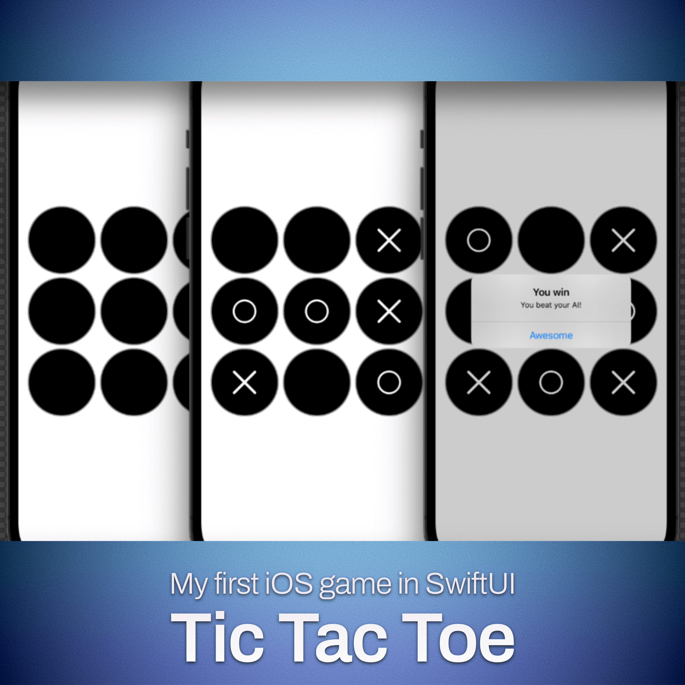

# My first game built using SwiftUI

I used [this tutorial by Sean Allen](https://www.youtube.com/watch?v=MCLiPW2ns2w), but made some changes and adjustments to make it mine.

I also refactored it to use MVVM architecture.

Really enjoyed learning SwiftUI and building this game. I'm sure I'll be building more apps and games in the future.